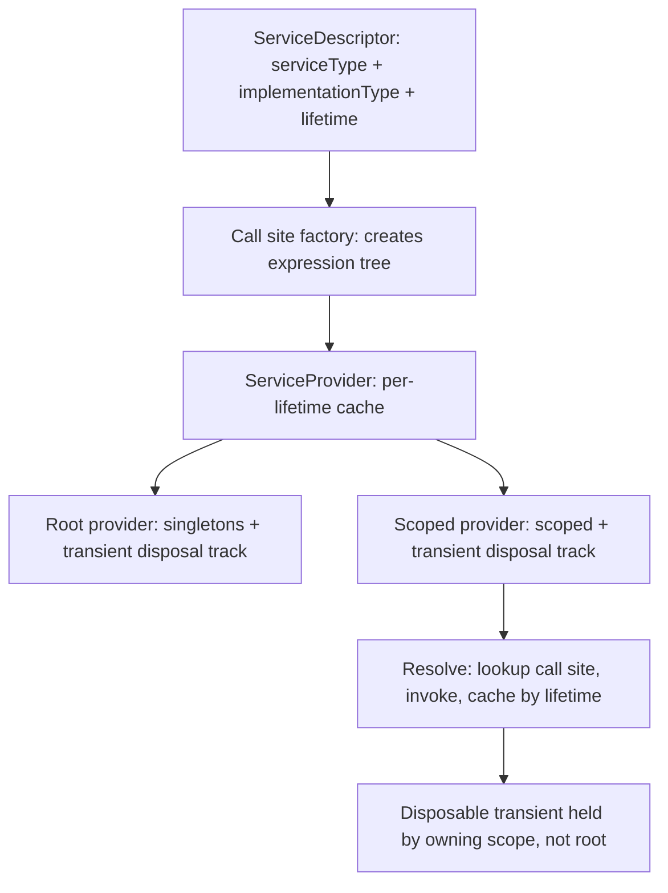
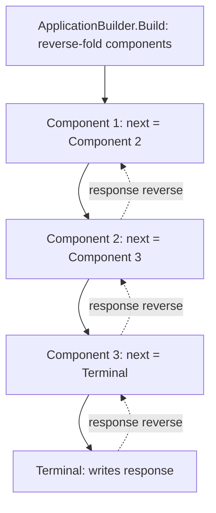
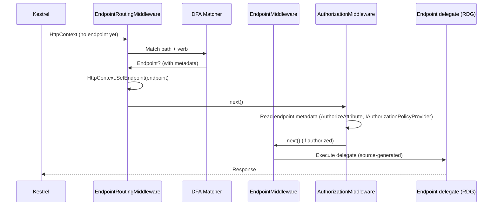
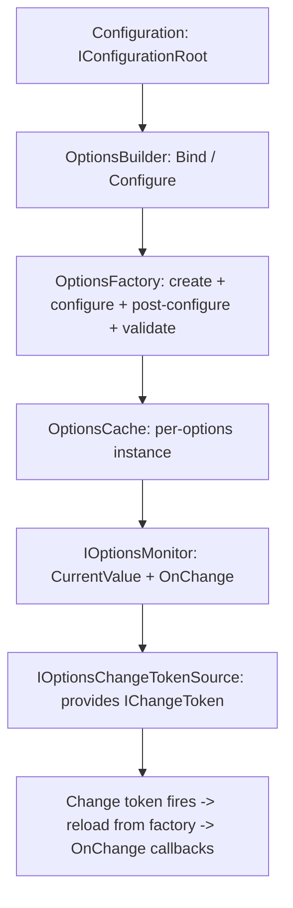
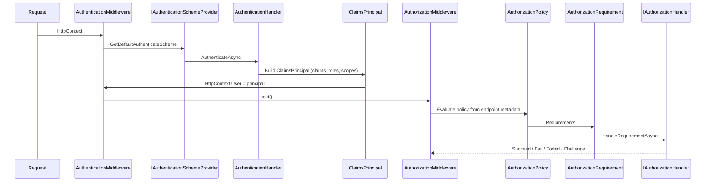

# Framework source: five object and call-chain maps

These maps trace the ASP.NET Core 10 subsystems the LearnAspNet labs exercise.
Source links pin to the .NET 10 release tag, never to `main`, so the maps stay
accurate. Verify the exact tag/commit by inspecting the running assembly via
Source Link (F12 in your IDE) before relying on a specific line.

Pinned reference points (verify at read time):

- `dotnet/aspnetcore` tag `v10.0.10` — Hosting, pipeline, routing, auth
- `dotnet/runtime` tag `v10.0.10` — DI, Options, Config, Logging
- `dotnet/efcore` tag `v10.0.10` — EF Core (referenced only where needed)

## 1. Dependency injection

The root provider caches singletons and tracks disposable transients only when
resolved from the root (a captive dependency risk). Scoped providers cache
scoped instances and own the disposal of transients resolved within them. The
`IServiceScopeFactory` creates a new scoped provider; the W1 `Step02_DIConfigOptions`
lab proves that two scopes yield different scoped instances, and the W4
`Part03_3` lab shows why resolving a scoped service from the root is a bug the
arch test catches.

Key types: `ServiceDescriptor`, `ServiceCallSite`, `ServiceProvider`,
`ServiceScope`, `IServiceScopeFactory`, `IServiceProviderIsService`.

Source: `Microsoft.Extensions.DependencyInjection` in `dotnet/runtime`.

## 2. Middleware pipeline (reverse fold)

`ApplicationBuilder.Build` walks the `IComponentBuilder` list in reverse,
wrapping each component around the next. The request flows forward through the
folded chain; the response flows back in reverse. `Use` adds a component;
`Run` adds a terminal. `UseMiddleware<T>` wraps `IMiddleware` (factory style)
or convention-based middleware. The W1 `Step03_MiddlewarePipeline` lab
demonstrates `Use`/`Run`/`Map`, `IMiddleware`, and `UseWhen`/`MapWhen`.

Key types: `IApplicationBuilder`, `ApplicationBuilder`, `RequestDelegate`,
`UseMiddlewareExtensions`, `IMiddleware`.

Source: `Microsoft.AspNetCore.Builder` in `dotnet/aspnetcore`.

## 3. Routing: endpoint, DFA, metadata

`EndpointRoutingMiddleware` runs the DFA matcher and sets the endpoint on the
`HttpContext`. `AuthorizationMiddleware` reads the endpoint's metadata
(`IAuthorizeData`, policies, requirements) before the endpoint executes.
`EndpointMiddleware` executes the delegate. With the Request Delegate
Generator (RDG, W9 Part11_2), the delegate is source-generated, not reflected.
The W1 `Step04_RoutingEndpoints` lab shows custom `IRouteConstraint`, nested
`MapGroup`, and endpoint filters; the W9 `Part11_3` `/lab/endpoint-metadata`
endpoint demonstrates that an authorization handler reads custom metadata
placed via `WithMetadata`.

Key types: `EndpointRoutingMiddleware`, `DfaMatcher`, `Endpoint`,
`RouteEndpoint`, `EndpointMetadataCollection`, `AuthorizationMiddleware`,
`RequestDelegateFactory`.

Source: `Microsoft.AspNetCore.Routing` and `Microsoft.AspNetCore.Authorization`
in `dotnet/aspnetcore`.

## 4. Options: configure, post-configure, validate, change token

`OptionsFactory` runs configure actions, then post-configure actions, then
validators, in order. `OptionsCache` holds the instance keyed by name.
`IOptionsMonitor` exposes `CurrentValue` and `OnChange`; `OnChange` subscribes
to the `IChangeToken` from `IOptionsChangeTokenSource<T>`. When the token
fires, the factory rebuilds and the monitor invokes callbacks. The W1
`Step02_DIConfigOptions` lab exercises `IOptionsMonitor.OnChange` with
user-secrets reload; the W9 `Part11_3` `/lab/options` endpoint demonstrates the
`IChangeToken` pattern directly.

Key types: `OptionsManager`, `OptionsFactory`, `OptionsCache`,
`IOptionsMonitor`, `IOptionsChangeTokenSource`, `IConfigureOptions`,
`IPostConfigureOptions`, `IValidateOptions`.

Source: `Microsoft.Extensions.Options` in `dotnet/runtime`.

## 5. Authentication and authorization

`AuthenticationMiddleware` uses the scheme provider to get the default scheme,
runs the handler, and sets `HttpContext.User`. `AuthorizationMiddleware`
reads the policy from endpoint metadata, evaluates requirements via
`IAuthorizationHandler` implementations, and produces `Succeed`/`Challenge`/
`Forbid`. Challenge triggers re-authentication (401); Forbid denies access
(403). The W1 `Step07_AuthnAuthzEntry` lab shows JWT bearer + `FallbackPolicy`
+ 401 vs 403; the W6 `Part05` labs use Keycloak OIDC + resource authorization;
the W9 `Part11_3` `/lab/auth` endpoint demonstrates the three paths.

Key types: `IAuthenticationSchemeProvider`, `AuthenticationHandler`,
`ClaimsPrincipal`, `AuthorizationMiddleware`, `AuthorizationPolicy`,
`IAuthorizationRequirement`, `IAuthorizationHandler`, `AuthorizationResult`.

Source: `Microsoft.AspNetCore.Authentication` and
`Microsoft.AspNetCore.Authorization` in `dotnet/aspnetcore`.
